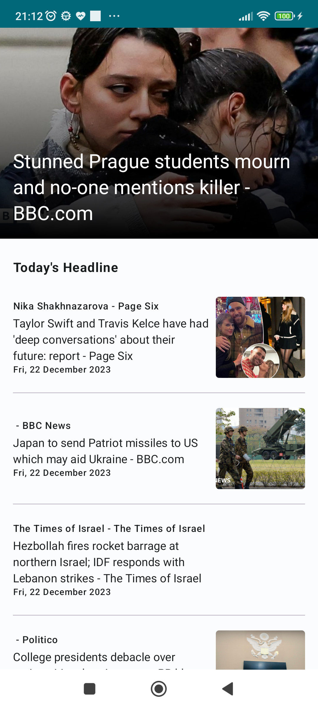

# News Apps
The project integrate with https://newsapi.org/ to get updated news.

## Screenshot
  

  

  

  

## How to run this
- Download JDK 17 ([link](https://www.oracle.com/java/technologies/javase/jdk17-archive-downloads.html))
- Change project setting JDK to 17
- Apply
- Rebuild project

## Tech Stack
- Design Pattern: MVVM
- Networking: Retrofit
- Dependency Injection: Hilt
- UI Framework: Jetpack compose
- Others:
  - Navigation compose
  - Jetpack paging lib
  - Material 3
  - Coroutine

## Structure
- Single activity, multi compose screen
- UI Layer: compose, view model
- Domain: use cases
- Data: repositories, api service
